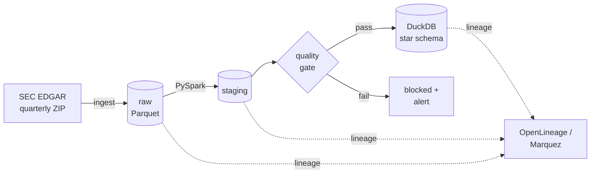

# Governed Data Platform

[](https://github.com/EST320/governed-data-platform/actions/workflows/ci.yml)

An end-to-end data platform on public regulatory filing data, built around
automated data quality gates and column-level lineage — the traceability
pattern that regulated reporting requires.

**Status:** ingestion layer implemented and tested. Transformation layer in progress.

---

## Why this project

Most portfolio pipelines stop at "the data moved." In a regulated setting the
harder questions come after that:

- Can you prove a load was complete?
- Can you show where a field came from, at column level?
- Does a bad load get stopped before it reaches a report, or after?

This project is built around those three questions rather than around the
transformation itself.

## Data

**SEC EDGAR Financial Statement Data Sets** — quarterly archives published by
the U.S. Securities and Exchange Commission. No API key, no registration.

| File | Contents | Role in the model |
|---|---|---|
| `sub.txt` | Filer metadata: name, CIK, SIC code, state, fiscal year end | Type 2 dimension |
| `num.txt` | Numeric facts per filing, per tag, per period | Fact table |
| `tag.txt` | XBRL taxonomy tags and definitions | Type 2 dimension |

Twelve quarters is roughly 60–100 million fact rows: large enough that Spark is
the tool rather than the decoration, and dirty enough — amended filings,
encoding inconsistencies, duplicate submissions — that the quality layer has
real work to do.

## Architecture



## Data model

Kimball star schema.

**Grain of `fact_financial_fact`:** one numeric value per filing (`adsh`) ×
tag × reporting period (`ddate`) × period length (`qtrs`). `adsh` is carried on
the fact table as a degenerate dimension.

**`dim_filer` is Type 2 because it has to be.** A company's name, SIC code and
registered state genuinely change between quarters in this dataset. Flattening
that to Type 1 would silently rewrite historical reports — which is the exact
failure mode that makes slowly changing dimensions a compliance concern rather
than a modelling preference.

## Stack

| Layer | Choice | Status |
|---|---|---|
| Ingestion | Python, requests, pandas → Parquet | Done |
| Processing | PySpark (local mode) | In progress |
| Warehouse | DuckDB | Planned |
| Quality | Great Expectations | Planned |
| Lineage | OpenLineage + Marquez | Planned |
| Orchestration | Apache Airflow | Planned |
| Runtime | Docker Compose | Planned |

## Quick start

```bash
git clone https://github.com/EST320/governed-data-platform.git
cd governed-data-platform
python -m venv .venv
source .venv/bin/activate        # Windows: .venv\Scripts\activate
pip install -r requirements.txt

# SEC asks automated clients to identify themselves
export SEC_USER_AGENT="Your Name you@example.com"   # Windows: $env:SEC_USER_AGENT="..."

python -m src.ingest.edgar --year 2025 --quarter 4
pytest
```

Output lands under `data/raw/<table>/year=YYYY/quarter=Q/`. The `data/`
directory is git-ignored.

## Design decisions

**Raw means raw.** The ingestion layer lands every column as a string and adds
two lineage columns, `_source_file` and `_ingested_at`. Typing and cleaning
belong in the transform layer, where they can be tested and changed without
re-downloading anything — and where a parsing bug cannot silently corrupt the
only copy of the source.

**Idempotent by partition.** Re-running a quarter overwrites that quarter's
partition and nothing else. A rerun can never duplicate rows or touch
neighbouring quarters.

**Downloads are atomic.** Archives are written to a `.part` file and renamed
only when complete, so an interrupted download never looks like a finished one.

**DuckDB rather than Postgres or a cloud warehouse.** The project has to be
reproducible by someone with five minutes and no cloud account. DuckDB is a
single file, needs no server, and is columnar, so it behaves like a warehouse
without being one to operate.

**Quality gates block rather than warn.** A failed expectation stops the
downstream task. A warning that nobody reads is not a control.

**Lineage at column level, not table level.** Table-level lineage tells you a
report depends on a source. Column-level tells you which field in which source
— which is the question actually asked when a number is disputed.

## Roadmap

- [x] Ingestion: quarterly archive download, retry, atomic write, idempotent raw landing
- [x] Unit tests and CI
- [ ] Transformation: PySpark typing, cleaning, amended-filing handling
- [ ] Warehouse: DuckDB star schema with SCD2 `dim_filer`
- [ ] Quality: Great Expectations suites wired as blocking gates
- [ ] Lineage: OpenLineage emission to Marquez
- [ ] Orchestration: Airflow DAG with retries and SLA alerting
- [ ] Incremental source: daily FX rates, demonstrating incremental load

---

Last updated: 2026-09-24
