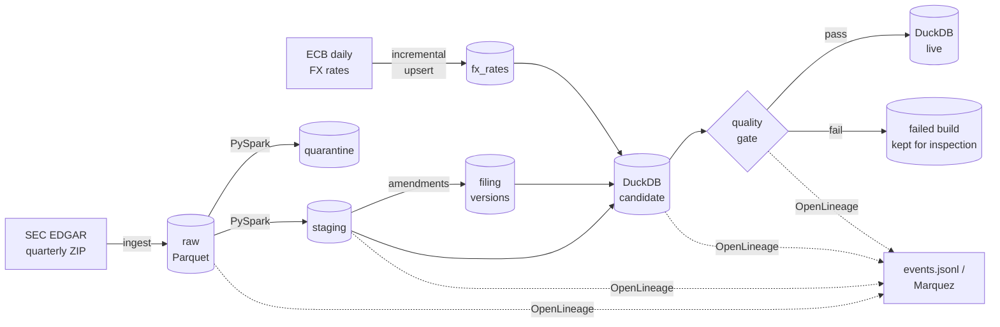

# Governed Data Platform

[](https://github.com/EST320/governed-data-platform/actions/workflows/ci.yml)

An end-to-end data platform on SEC financial statement data: ingestion, Spark
transformation, a DuckDB star schema with point-in-time queries, a blocking
quality gate, OpenLineage events with column-level lineage, an incrementally
loaded FX source, and Airflow DAGs with retries and deadline alerts.

**Status:** all roadmap items implemented and tested.

---

## Why this project

Most portfolio pipelines stop at "the data moved." The harder questions come after that:

- **Can you prove a load was complete?** Every step checks that rows in = rows out + rows rejected, and fails if not.
- **Can you show where a number came from?** Every warehouse column declares its source columns; the lineage is emitted as OpenLineage and a missing declaration fails the build.
- **Does a bad load get stopped before anyone reads it?** The warehouse is built next to the live one and only replaces it after passing the quality gate.
- **What did we know, and when?** Companies amend their reports. Overwriting the old numbers silently rewrites history; this platform keeps every version and can answer "what was the reported value as of date D".

The last question is what point-in-time data is for: a backtest that uses a
restated number before the restatement was published has look-ahead bias,
and its results look better than anything that could have been traded.

## Data

**SEC EDGAR Financial Statement Data Sets**: quarterly archives published by
the U.S. Securities and Exchange Commission. No API key, no registration.

| File | Contents | Used for |
|---|---|---|
| `sub.txt` | one row per filing: company, form, period, acceptance time | `dim_filer` (SCD2), `dim_filing` |
| `num.txt` | numeric facts per filing, tag and period | `fact_financial_fact` |
| `tag.txt` | XBRL tag definitions | `dim_tag` |

Twelve quarters is tens of millions of fact rows, and the data is dirty in
realistic ways: amended filings, the same figure reported in several filings,
malformed values, custom tags without definitions.

**ECB euro reference rates**: daily exchange rates from the European Central
Bank's data API, loaded incrementally. Some filers report in EUR, JPY, GBP and
other currencies; the rates let the warehouse express those facts in USD.

## Architecture



## Layers

| Layer | Path | Contents |
|---|---|---|
| raw | `data/raw/<table>/year=YYYY/quarter=Q/` | source as landed, every column a string |
| staging | `data/staging/<table>/year=YYYY/quarter=Q/` | typed, trimmed, one row per natural key |
| quarantine | `data/quarantine/<table>/year=YYYY/quarter=Q/` | rejected rows, raw values plus `_reject_reason` |
| filing versions | `data/staging/filing_versions/` | every filing linked to its earlier and later versions |
| fx rates | `data/staging/fx_rates/year=YYYY/` | ECB rates, upserted incrementally; watermark in `data/state/fx_watermark.json` |
| warehouse | `data/warehouse/edgar.duckdb` | star schema, published only after the quality gate |
| quality log | `data/warehouse/quality_log.jsonl` | every check of every run, including rejected builds |
| lineage | `data/lineage/events.jsonl` | OpenLineage events for every step |

## Warehouse

Kimball star schema in DuckDB. Full column list in [docs/data_model.md](docs/data_model.md).

| Table | Grain | Notes |
|---|---|---|
| `fact_financial_fact` | one staged fact: filing × tag × date × period length × unit × dimension | `value` is `DECIMAL(28,4)`; `known_at` is when the filing became public |
| `dim_filer` | company × attribute version | **SCD Type 2** on name, SIC code, state, country |
| `dim_filing` | filing | version chain: `version_no`, `is_latest`, `valid_from`, `valid_to` |
| `dim_tag` | tag × taxonomy version | Type 1; tags used but never described get their own flagged row |
| `dim_date` | day | quarter-end flag |
| `fx_rate_daily`, `fx_usd_daily` | day × currency | ECB rates per EUR, and derived USD per unit |

**Point-in-time queries**

```sql
-- Revenue as the market could see it on 1 March 2024
SELECT * FROM facts_as_of(TIMESTAMP '2024-03-01') WHERE tag = 'Revenues';

-- Latest known values
SELECT * FROM v_facts_current WHERE cik = 320193;
```

```sql
-- Monetary facts in USD; weekend and holiday dates use the last fixing before them
SELECT cik, tag, ddate, uom, value, value_usd, fx_date FROM v_facts_current_usd WHERE uom <> 'USD';
```

For every fact (company, concept, period, unit, dimension), `facts_as_of(ts)`
returns the value from the most recently accepted filing that was already
public at `ts`. This covers amendments and the more common case of a figure
being restated as a comparative in the following year's report.

## Quality gate

Each check is a SQL query that counts offending rows. `error` checks block
publication; `warn` checks are recorded and reported.

| Check | Severity |
|---|---|
| fact grain unique; every fact resolves to a company version, a tag and a date; no NULL values | error |
| fact rows reconcile exactly to staged rows | error |
| SCD2: one current version per company; intervals valid and contiguous | error |
| one latest version per filing family | error |
| every warehouse column has declared lineage | error |
| quarantine rate below 5% (error) / 1% (warn) | error / warn |
| balance sheet balances: Assets = Liabilities + Equity | warn |
| FX rates positive and unique per day and currency | error |
| facts whose tag has no definition; amendments referenced but not loaded; non-USD facts without a rate | warn |

## Lineage

Every step emits OpenLineage `START` then `COMPLETE` or `FAIL`, with input and
output datasets. Outputs carry schema and row counts; warehouse tables carry
column-level lineage; the quality gate reports its checks as data quality
assertions. Events always go to `data/lineage/events.jsonl`, and also to a
lineage backend when `OPENLINEAGE_URL` is set:

```bash
export OPENLINEAGE_URL=http://localhost:5000   # a local Marquez
```

If the backend is unreachable the pipeline continues and logs a warning.

## Incremental load (FX)

EDGAR arrives as whole quarterly archives, so a quarter is simply replaced.
Rates arrive one day at a time, so `src/ingest/fx.py` loads them incrementally:

- **Watermark**: the latest date loaded, stored in `data/state/fx_watermark.json`.
  Each run asks the ECB only for `watermark - 7 days` to today.
- **Lookback**: the 7-day overlap re-reads recent days, so a late publication or
  a corrected rate is picked up instead of missed.
- **Upsert** on (date, currency): inserted, updated and unchanged rows are
  counted separately. Running twice gives the same result as running once.
- **Only touched partitions are rewritten**, each through a temporary file and
  an atomic rename.
- **The watermark moves only after every write succeeded**, and never
  backwards. A failed or rejected batch leaves data and watermark unchanged, so
  the next run retries the same window.

## Orchestration (Airflow)

`dags/edgar_pipeline.py` defines two DAGs for Airflow 3.1+. Both call the same
step functions as the command line (`src/pipeline.py`).

| DAG | Schedule | Tasks |
|---|---|---|
| `fx_rates_daily` | weekdays 17:00 Frankfurt, after the ECB fixing | `load_fx_rates` |
| `edgar_quarterly` | 06:00 UTC on 5 Jan / Apr / Jul / Oct | `previous_quarter` → `ingest` → `stage` → `amendments` → `build_and_publish` |

**Retries.** Exponential backoff everywhere. The SEC download gets 5 retries and
the ECB load 4, because network failures are usually transient. The quality gate
gets **none**: a failed check fails again on the same data, and retrying only
delays the alert.

**Timing.** Airflow 3 removed the old task-level SLA. Two mechanisms replace it:
hard limits (`execution_timeout` per task, `dagrun_timeout` per run) turn a hung
step into a failure; a **DeadlineAlert** fires if a run has not finished within
its target (30 min for FX, 3 h for EDGAR) after being queued, even while it is
still running.

**Alerts.** Task failures (after the last retry) and missed deadlines post to a
Slack- or Discord-compatible webhook set in `ALERT_WEBHOOK_URL`. An alert that
cannot be delivered is logged, never raised.

**Concurrency.** `max_active_runs=1` on both DAGs: two FX loads must never upsert
the same partition at once. `catchup=False` because the FX watermark already
covers missed days.

CI runs the DAG structure tests in a separate job with Airflow installed, so
Airflow stays out of `requirements.txt`.

## Quick start

```bash
git clone https://github.com/EST320/governed-data-platform.git
cd governed-data-platform
python -m venv .venv
source .venv/bin/activate
pip install -r requirements.txt

# SEC asks automated clients to identify themselves
export SEC_USER_AGENT="Your Name you@example.com"

# everything: download EDGAR, load FX, stage, link amendments, build, gate, publish
python -m src.pipeline --quarters 2025q3 2025q4 --download --fx

pytest
```

Individual steps can also be run on their own: `src.ingest.edgar`, `src.ingest.fx`,
`src.transform.edgar_staging`, `src.transform.amendments`, `src.warehouse.build`.

Spark needs Java 17 or later. On Windows, use WSL: Spark's local file writes on
native Windows need extra Hadoop binaries.

## Stack

| Layer | Choice | Status |
|---|---|---|
| Ingestion | Python, requests, pandas → Parquet | Done |
| Processing | PySpark (local mode) | Done |
| Warehouse | DuckDB | Done |
| Quality | SQL checks as a blocking gate | Done |
| Lineage | OpenLineage (file + HTTP to Marquez) | Done |
| Incremental source | ECB data API, watermark + lookback + upsert | Done |
| Orchestration | Apache Airflow 3.1 | Done |

## Design decisions

**Raw means raw.** The ingestion layer lands every column as a string and adds
two lineage columns, `_source_file` and `_ingested_at`. Typing and cleaning
belong in the transform layer, where they can be tested and changed without
re-downloading anything.

**Idempotent by partition.** Re-running a quarter replaces that quarter's
partitions and nothing else.

**Downloads are atomic.** Archives are written to a `.part` file and renamed
only when complete, so an interrupted download never looks like a finished one.

**Bad values go to quarantine, never to NULL.** Parsing uses `try_cast` and
`try_to_timestamp`. A value that is present but cannot be parsed sends the row
to quarantine with a reason such as `unparseable_value` or `orphan_fact`, raw
values intact. Turning it into NULL would make a data problem look like a
missing value.

**Every run proves it lost nothing.** Staging checks
`input = staged + quarantined + duplicates_dropped`, counted from the files
actually written; the warehouse checks fact rows against staged rows. This
check caught a real bug during development: a cached DataFrame from a previous
run was being reused, and the run reported a quarantined row that was no longer
in the source.

**Duplicates that disagree are not resolved by guessing.** Identical rows
collapse to one. Rows with the same key but different content all go to
quarantine as `conflicting_duplicate`.

**Amendments are versions, not overwrites.** A 10-K/A does not replace the
original 10-K. Filings are grouped by company, report type and period, ordered
by acceptance time, and each version gets `valid_from` / `valid_to`.

**Build next to live, publish only after the gate.** The warehouse is built
into a separate file. Only a build that passes every error-level check replaces
the live file, with an atomic rename. A rejected build is kept as
`edgar.failed.duckdb`, and its check results stay in the quality log.

**SQL checks rather than Great Expectations.** The checks run inside DuckDB on
full tables with no data copied into Python, and each one is a query that can be
pasted into a console to list the offending rows. The cost is no generated
documentation site; `quality_results` and the JSON log take its place.

**Lineage is declared, and the declaration is enforced.** `COLUMN_LINEAGE` in
`src/warehouse/build.py` maps each warehouse column to its staging sources. It
is what gets emitted to OpenLineage, and the quality gate fails if a warehouse
column has no entry, so lineage cannot silently fall behind the schema.

**DuckDB rather than Postgres or a cloud warehouse.** The project has to be
reproducible by someone with five minutes and no cloud account. DuckDB is a
single file, needs no server, and is columnar.

## Roadmap

- [x] Ingestion: quarterly archive download, retry, atomic write, idempotent raw landing
- [x] Unit tests and CI
- [x] Transformation: PySpark typing, cleaning, quarantine, amended-filing handling
- [x] Warehouse: DuckDB star schema, SCD2 `dim_filer`, point-in-time queries
- [x] Quality: blocking gate with recorded results
- [x] Lineage: OpenLineage events with column-level lineage
- [x] Orchestration: Airflow DAGs with retries, timeouts, deadline alerts and webhook alerting
- [x] Incremental source: daily FX rates, watermark + lookback + idempotent upsert

---

Last updated: 2026-09-24
